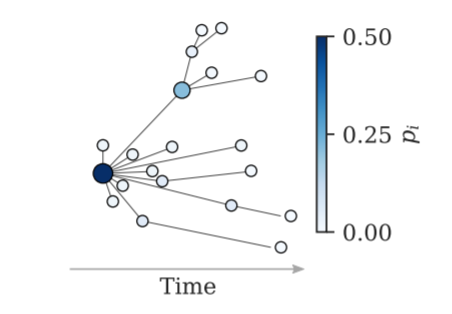

# Temporal recovery in grown trees

Python implementation of efficient recovery algorithms for the history of grown trees, introduced in "*[Recovering the past states of growing trees](https://arxiv.org/abs/1910.XXX)*".

## Dependencies

* [`networkx`](https://networkx.github.io)
* `numpy`
* [`mpmath`](http://mpmath.org/) (optional --- needed for one-node marginals)

## Code overview

* `temporal_recovery.py` contains our algorithms for recovering the history of a tree.
* `boundary_sampler.py` is a Python implementation of the data structure described in section 3.2.2 of ["*Efficient sampling of spreading processes on complex networks using a composition and rejection algorithm*"](https://arxiv.org/abs/1808.05859)
* `full_marginal.py` contains our algorithms for the one-node marginals.
* A C++/Python version of this code is available at [https://github.com/gstonge/fasttr](https://github.com/gstonge/fasttr)

## Reference

If you use this code, please consider citing:

"[*Recovering the past states of growing trees*](https://arxiv.org/abs/1910.XXX)" 
[G. T. Cantwell](https://www.george-cantwell.com), [G. St-Onge](https://gstonge.github.io) and [J.-G. Young](http://jgyoung.ca) 
arxiv:1910.XXX (2019)  

## Author information

Code by [George T. Cantwell](https://www.george-cantwell.com). Don't hesitate to get in touch at <gcant@umich.edu>, or via the [issues](temporal-recovery-tree-py/issues)!
